# Gestao de Alunos API

API RESTful desenvolvida em C# com ASP.NET Core, Entity Framework Core e MySQL para gerenciamento de alunos.

## Integrantes

- Guilherme Santos Nunes - RM 558989
- Kaique Rodrigues Zaffarani - RM 556677
- Pedro Josue Pereira Almeida - RM 554913

## Contexto do Projeto

O projeto tem como objetivo oferecer uma API para cadastro, consulta, atualizacao e remocao de alunos.

A aplicacao resolve a necessidade de centralizar dados academicos basicos, como nome, email, matricula, curso, periodo, data de nascimento e status do aluno. Ela pode ser utilizada por sistemas internos de instituicoes de ensino, paineis administrativos ou outras aplicacoes que precisem consumir informacoes de alunos via HTTP.

## Banco de Dados

Banco utilizado: **MySQL**

Nome do banco local utilizado no desenvolvimento:

```text
gestao_alunos
```

O acesso ao banco e configurado no arquivo:

```text
WebApplication1/appsettings.json
```

Exemplo de connection string:

```json
{
  "ConnectionStrings": {
    "DefaultConnection": "server=localhost;port=3306;database=gestao_alunos;user=root;password=sua_senha;"
  }
}
```

## Tecnologias Utilizadas

- **C#**: linguagem principal da aplicacao.
- **.NET 10**: plataforma utilizada para desenvolvimento e execucao da API.
- **ASP.NET Core Web API**: framework usado para criacao dos endpoints REST.
- **Entity Framework Core**: ORM usado para mapear entidades C# para tabelas do banco de dados.
- **Pomelo.EntityFrameworkCore.MySql**: provider que permite ao Entity Framework Core se comunicar com MySQL.
- **MySQL**: banco de dados relacional usado para persistencia dos dados.
- **Swagger / Swashbuckle**: ferramenta usada para documentar e testar os endpoints da API.
- **Asp.Versioning.Mvc.ApiExplorer**: pacote usado para implementar e documentar o versionamento da API.

## Estrutura do Projeto

```text
WebApplication1/
├── Controllers/
│   └── AlunosController.cs
├── Data/
│   └── AppDbContext.cs
├── Dtos/
│   ├── AlunoAtualizacaoDto.cs
│   ├── AlunoCriacaoDto.cs
│   └── AlunoRespostaDto.cs
├── Migrations/
│   ├── 20260930005050_InitialCreate.cs
│   ├── 20260930005050_InitialCreate.Designer.cs
│   └── AppDbContextModelSnapshot.cs
├── Models/
│   └── Aluno.cs
├── Program.cs
├── appsettings.json
└── WebApplication1.csproj
```

## Papel das Principais Partes

### Model

`Aluno.cs` representa a entidade principal do sistema. Ela define os campos que serao persistidos no banco de dados, como nome, email, matricula, curso, periodo, data de nascimento, status e data de criacao.

### DTOs

Os DTOs definem os dados que entram e saem da API:

- `AlunoCriacaoDto`: usado para receber dados no cadastro de um aluno.
- `AlunoAtualizacaoDto`: usado para receber dados na atualizacao de um aluno.
- `AlunoRespostaDto`: usado para retornar dados ao cliente.

### DbContext

`AppDbContext.cs` representa o contexto do Entity Framework Core. Ele configura a entidade `Aluno`, a tabela `alunos`, a chave primaria, os tamanhos dos campos e os indices unicos de email e matricula.

### Controller

`AlunosController.cs` contem os endpoints REST da API. Ele recebe as requisicoes HTTP, valida os dados, acessa o banco via `AppDbContext` e retorna os status codes apropriados.

### Migrations

As migrations documentam e aplicam as alteracoes no banco de dados. A migration `InitialCreate` cria a tabela `alunos` e seus indices.

## Como Rodar o Projeto Localmente

### 1. Clonar o repositorio

```powershell
git clone URL_DO_REPOSITORIO
cd CP02-CSHARP-API-REST-ENTITY-FRAMEWORK/WebApplication1
```

### 2. Configurar o banco MySQL

Crie o banco de dados:

```sql
CREATE DATABASE gestao_alunos;
```

Configure a connection string em `WebApplication1/appsettings.json` com usuario e senha validos do MySQL.

### 3. Restaurar dependencias

```powershell
dotnet restore
dotnet tool restore
```

### 4. Aplicar as migrations

```powershell
dotnet tool run dotnet-ef database update
```

### 5. Executar a aplicacao

```powershell
dotnet run
```

### 6. Acessar o Swagger

```text
http://localhost:5222/swagger
```

## Versionamento da API

A API utiliza versionamento na URL. A versao atual e:

```text
/api/v1
```

Exemplo:

```text
GET /api/v1/alunos
```

## Endpoints Disponiveis

| Metodo | Rota | Descricao | Status codes esperados |
| --- | --- | --- | --- |
| GET | `/api/v1/alunos` | Lista todos os alunos cadastrados | 200 |
| GET | `/api/v1/alunos/{id}` | Busca um aluno pelo ID | 200, 404 |
| POST | `/api/v1/alunos` | Cadastra um novo aluno | 201, 400 |
| PUT | `/api/v1/alunos/{id}` | Atualiza os dados de um aluno existente | 204, 400, 404 |
| DELETE | `/api/v1/alunos/{id}` | Remove um aluno pelo ID | 204, 404 |

## Exemplos de Requisicao

### POST `/api/v1/alunos`

```json
{
  "nome": "Ana Souza",
  "email": "ana.souza@email.com",
  "matricula": "RM12345",
  "curso": "Analise e Desenvolvimento de Sistemas",
  "periodo": 5,
  "dataNascimento": "2002-04-15"
}
```

### PUT `/api/v1/alunos/{id}`

```json
{
  "nome": "Ana Souza Atualizada",
  "email": "ana.atualizada@email.com",
  "matricula": "RM12345",
  "curso": "Engenharia de Software",
  "periodo": 6,
  "dataNascimento": "2002-04-15",
  "ativo": true
}
```

## Evidencias de Teste

As evidencias abaixo contem prints do Swagger demonstrando os endpoints funcionando. Imagens com o mesmo nome descritivo e numeracoes diferentes devem ser lidas verticalmente, em ordem numerica crescente.

### Interface Swagger

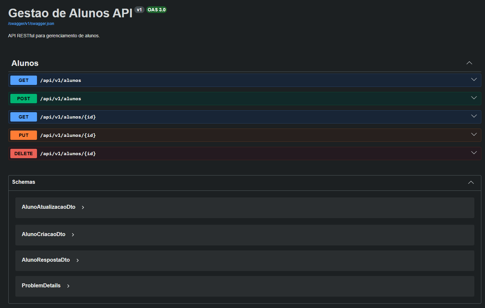

### 1. POST `/api/v1/alunos` - Cadastro de aluno

Status esperado: **201 Created**

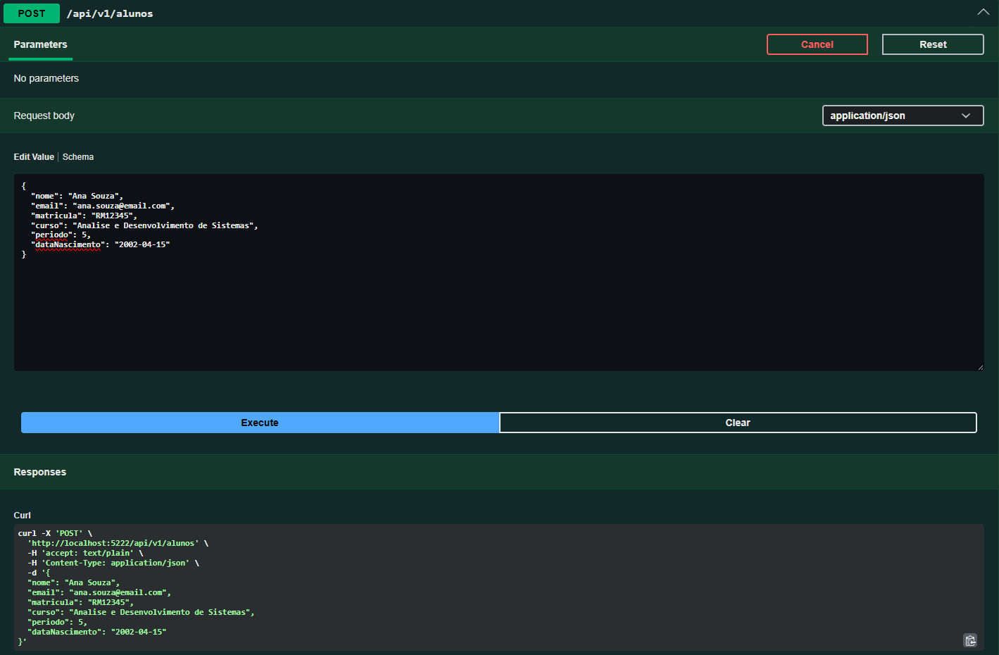

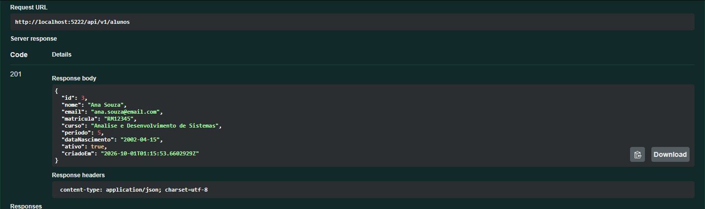

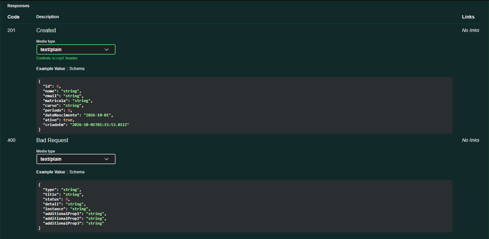

### 2. GET `/api/v1/alunos` - Listagem de alunos

Status esperado: **200 OK**

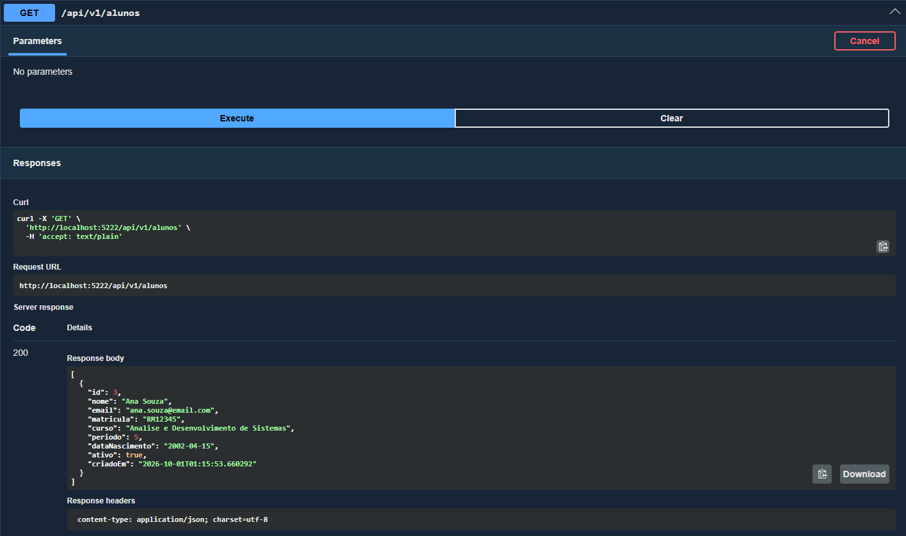

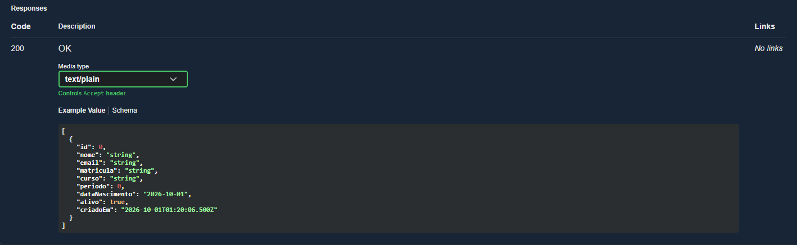

### 3. GET `/api/v1/alunos/{id}` - Busca por ID

Status esperado: **200 OK**

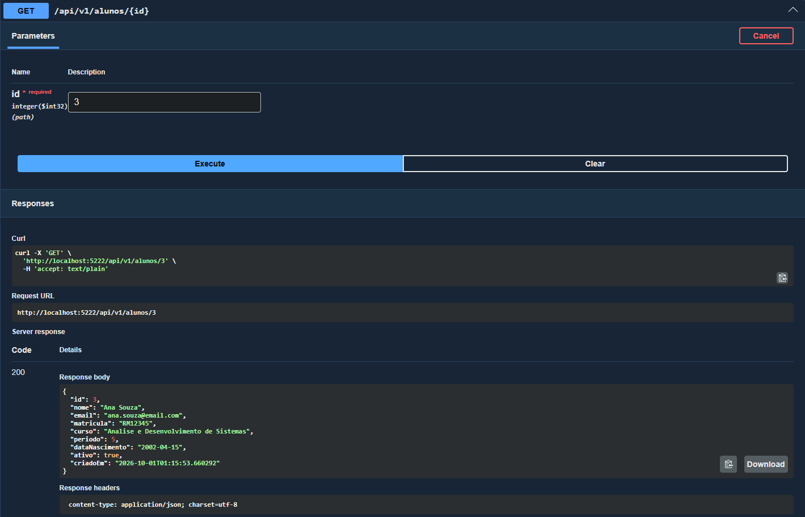

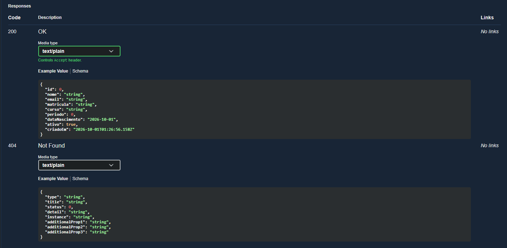

### 4. PUT `/api/v1/alunos/{id}` - Atualizacao de aluno

Status esperado: **204 No Content**

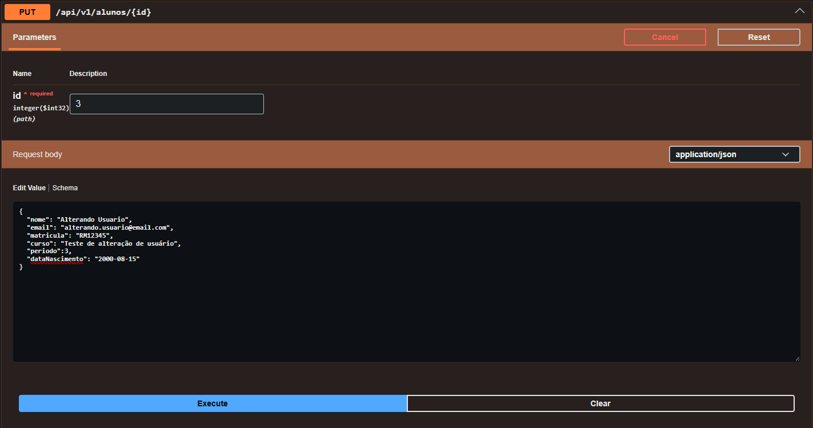

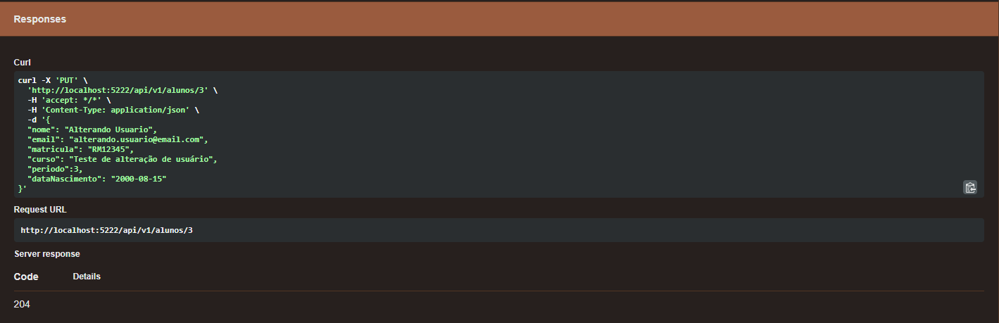

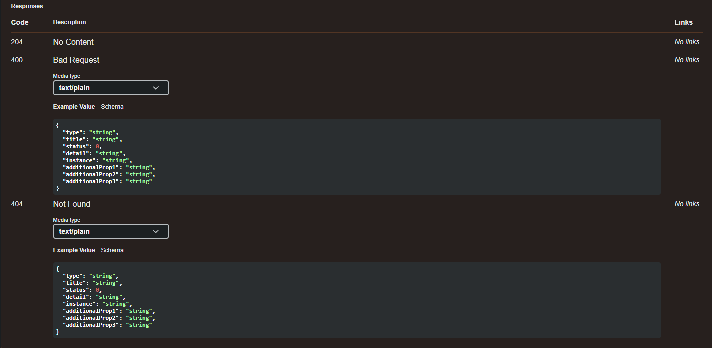

### 5. DELETE `/api/v1/alunos/{id}` - Remocao de aluno

Status esperado: **204 No Content**

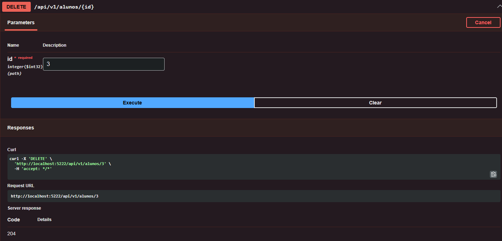

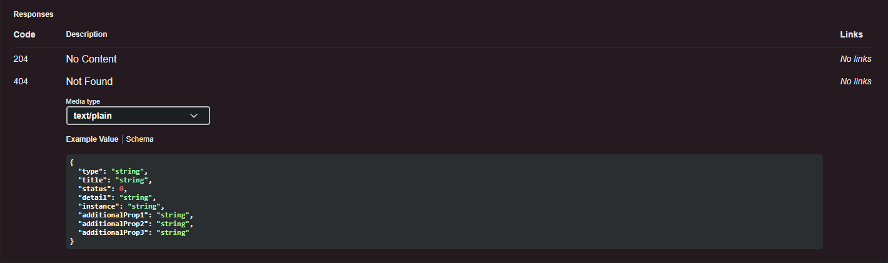

### 6. GET `/api/v1/alunos/{id}` - Registro nao encontrado

Status esperado: **404 Not Found**

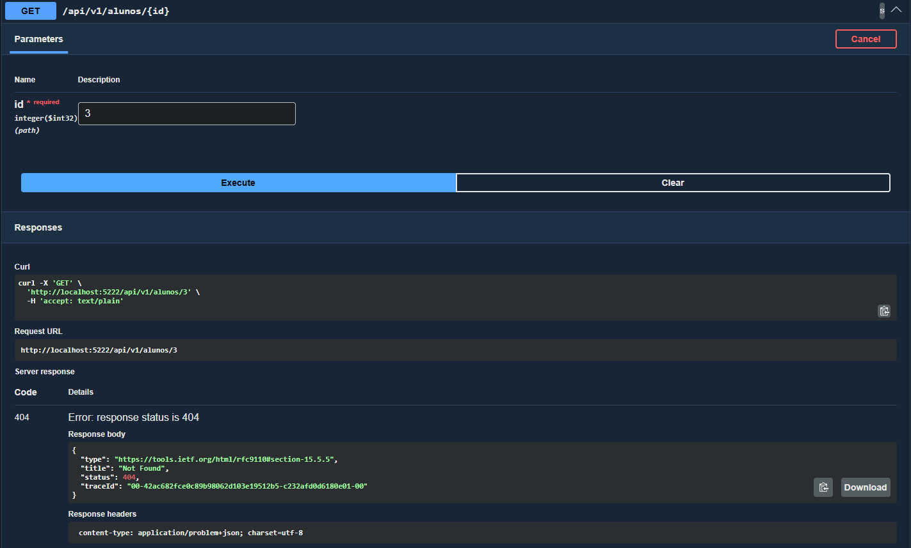

### 7. POST `/api/v1/alunos` - Requisicao invalida

Status esperado: **400 Bad Request**

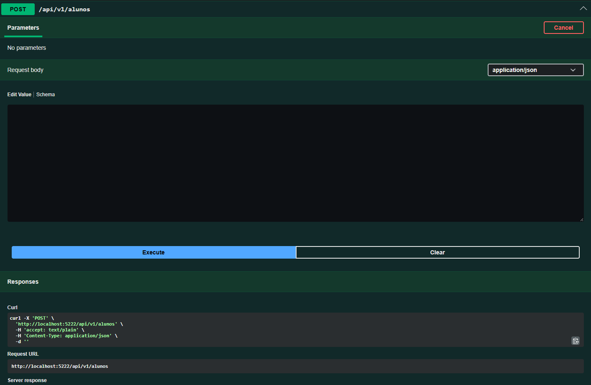

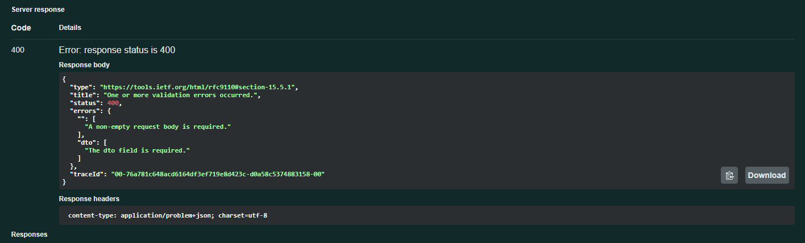

## Observacoes

- O projeto deve ser executado com o MySQL ativo.
- A tabela `alunos` e criada por migration do Entity Framework Core.
- Antes de testar os endpoints, execute `dotnet tool run dotnet-ef database update`.
- O Swagger fica disponivel em ambiente de desenvolvimento.
